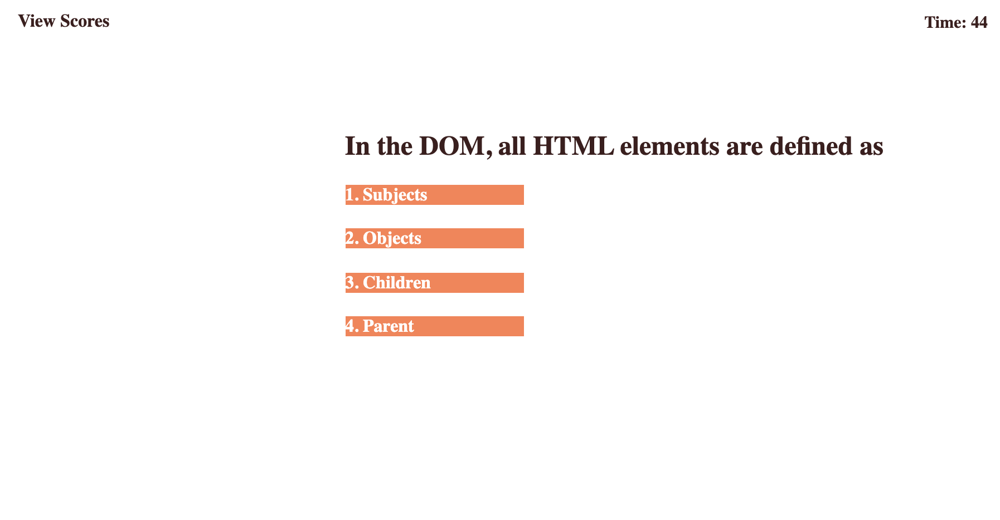
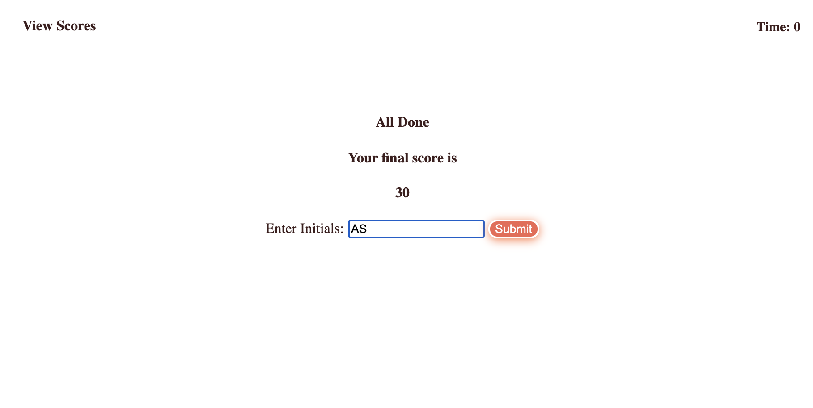
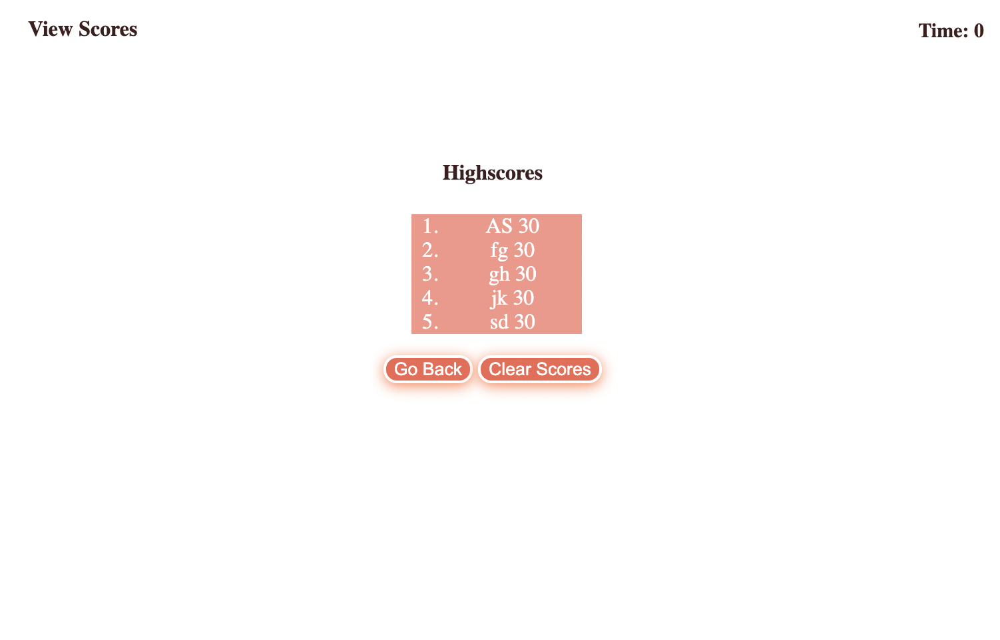
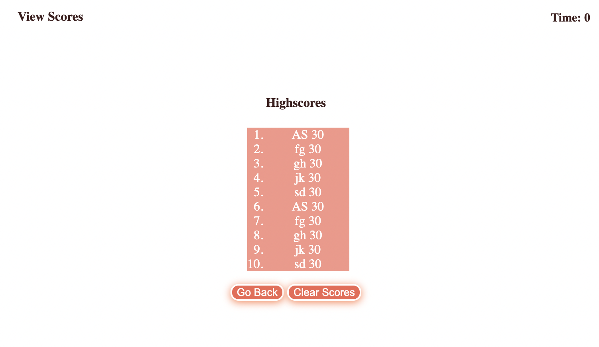
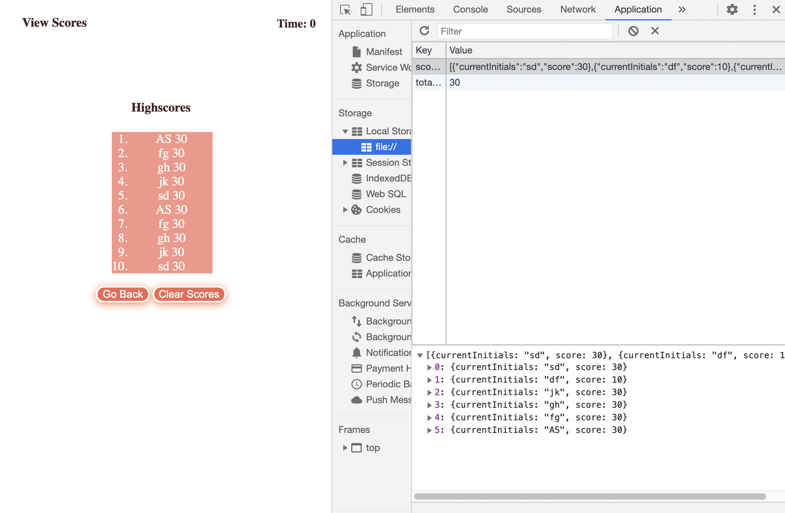

# Code-Quiz

## Table of contents

* General info
* Specifics
* Screenhots
* Deployment of application
* Comments

## General info

 Multiple choice quiz was build based on homework specifics. It includes:
  * section with questions and answers and timer assigned to it
  * result section with displayed points and input section
  * window displaying top 5 highest scores
  * options to clear all scores/go back to start again quiz
  * window to view all saved scores

## Specifics
  
 * after answering the question, you will be presented with the next question automatically
 * you can see right away if you answer was correct/wrong 
 * if your answer was wrong the penalty of -10 seconds will apply
 * if your answer was correct you will receive 10 points
 * once all questions answered or the timer reached 0, you will be  presented with option to put    your initials and submit the result
 * your result will be saved in local storage, and displayed to you after submit button clicked
 * you will be able to see after top 5 players with highest scores
 * Ii you want to see the list of previous scores, you can press View  Scores option
* you can delete all saved results but clicking clear scores button, that deletes all previously saved results in the local storage
* you will be presented with option to go back, where you can start quiz again/ or you can refresh the page and start quiz again

## Deployment of application

To run a project, please follow the link [https://sheymanidze.github.io/Code-Quiz/](https://sheymanidze.github.io/Code-Quiz/)

## Screenhots
 

 

 

 
 
 

 

## Comments

 One of the desired functions I would like to incorporate later is the option to delete only current score saved in local storage instead of deleting entire saved information. Also, since quiz was build based on the homework example, I decided not to include buttons “next” after each question, or progress bar with correct answers and questions left. Personally, it was more challenging to do it without “next” button option. Overall, all quiz was built slowly in terms of time but with clear understanding about every single line, function, structure and etc. Everything that was used in current project can be easily applied in the future outside the school. 

